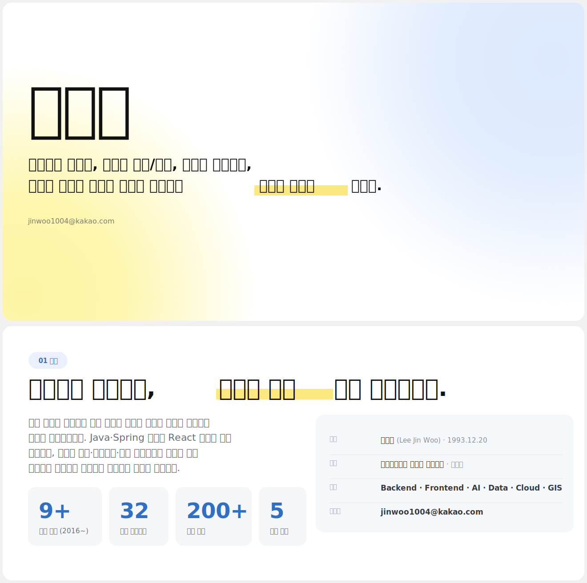

 

## 소개

특정 언어에 얽매이지 않고, 필요한 기술을 빠르게 실전에 적용합니다.

Java·Spring 서버와 React 앱을 중심으로 **GS그룹 건설 부문**, **롯데리아**,
**공공기관 국가 사업**까지 성격이 다른 도메인에서 시스템을 설계하고 구축해 왔습니다.

 

## 경력

**GS그룹 건설 부문** · 전사 DX · Platform / AI / Data 
`2025.08 ~ 현재` — 업무·안전·AI·데이터센터 플랫폼을 기획부터 구축까지 주도

**GS그룹 건설 부문** · 홈 IoT · Backend 
`2023.08 ~ 2025.08` — 아파트 단지 IoT 플랫폼. 실시간 통신, 보안, 배치 서버

**공공기관 국가 공간정보 사업** · GIS Full-stack 
`2020.06 ~ 2023.07` — 통계청, 국토지리정보원, 환경공단, 지자체 시스템 구축

**롯데리아** · 통합 서비스 · Backend 
`2017.02 ~ 2020.05` — 결제 데몬, 배달 API, POS, 콜센터, 배치

**삼성 스마트 TV 플랫폼** · QA 
`2016.10 ~ 2017.01` — 다수 TV 앱 품질 검증

 

## 대표 프로젝트

<b>AI 예상 공사비 예측 시스템</b> · 견적 22일 → 3일

 

**문제** 예상 공사비 산출에 2~3주가 걸려 협의가 지연됩니다 
**모델** CatBoost로 원가 8종 학습. 평당 단가를 로그 변환해 예측 
**신뢰도** KFold 5 앙상블 평균과 표준편차로 95% 신뢰구간 제공 
**정합 보정** 총공사비를 고정하고 항목 합계를 정확히 일치 
**MLOps** 학습 승인 워크플로, 델타 감지, 실행 단위 지표 기록 
**결과** 약 20일 단축. 견적·조달 표준화와 후속 AI 과제의 기반

<b>민원 대응 통합 플랫폼</b> · 통합 검색과 생성형 AI 요약

 

**문제** 민원이 여러 채널로 접수되어 현황 파악과 이력 관리가 어렵습니다 
**통합 검색** 검색 인프라 없이 도메인 API 오케스트레이션으로 구성 
**질의 이해** 조사와 불용어를 제거해 떨어진 단어도 매칭. AND 후 OR 폴백 
**생성형 AI** 실데이터에만 근거해 환각 억제. 인용을 눌러 원문서로 이동 
**안정성** 입력 해시 캐싱과 규칙 기반 폴백으로 검색은 멈추지 않음 
**결과** 대응 속도와 품질 향상. 대응 노하우를 데이터로 축적

<b>외부 데이터 연동 & 데이터센터</b> · 외부 데이터를 회사의 자산으로

 

**문제** 사내외 데이터가 분리되어 통합 조회와 재사용이 어렵습니다 
**설계** 단일 진입점 중계 서버로 수집, 검증, 저장을 표준화 
**구현** 공통 API 연계, 정합성 검증, 에러 재처리, 연동 스키마 설계 
**결과** 데이터 소유권 확보. AI 분석과 생산성 예측의 기반

 

## 전체 프로젝트

<b>Data & Cloud</b> · GS그룹 건설 부문

 

**외부 데이터 연동 & 데이터센터** — 흩어진 데이터를 표준 REST API로 개방 

**AWS 테스트서버 & GitHub 조직** — 인프라 표준화, 브랜치 보호와 2FA 

**건축주택 데이터 표준 템플릿** — 공통 키 기반 재사용 데이터 모델 

<b>AI & Automation</b> · GS그룹 건설 부문

 

**AI 예상 공사비 예측 시스템** — 원가 8종 예측과 합계 정합 보정 

**AI 견적 대비표 작성 시스템** — 내역 분개 자동화, ±20% 이상값 강조 

**홈솔루션 통합 모니터링 방안** — 사후 대응을 사전 감지로 전환 

<b>Enterprise Platform</b> · GS그룹 건설 부문

 

**민원 대응 통합 플랫폼** — 통합 검색과 생성형 AI 요약 

**아파트 단지 IoT 플랫폼** — 월패드와 공용부 실시간 통신 안정화 

**WorkHub 전사 통합 포털** — 전사 진입 경로를 SSO로 통합 

**자이렉트 제안제도 플랫폼** — 접수부터 심사와 포상까지 시스템화 

**하도급 대금 지급 검증** — 4대 지급 리스크 자동 탐지 

**영업 정보 시스템** — 수주 단계와 담당자 현황 가시화 

**작업 일보 시스템** — 종이 일보를 전자결재로 전환 

**프리콘 이행 점검 관리** — 점검에서 개선, 확인까지 폐루프 

**IT 자산관리 시스템** — 지급과 회수, 재고 이력 표준화 

**PTW 고위험 작업 관리** — 29개 공종 체크리스트 자동 구성 

**SAFETY CSO 앱 통합** — 안전관리 기능을 하나의 앱으로 

**작업중지권 STOP CALL** — 사진과 음성 신고. 누적 1,200건 이상 

**재해율 분석 SAFEYE** — 재해 데이터 입력에서 시각화까지 

**레미콘 불량 알림 서버** — 조건 검증 후 자동 전송과 실패 재처리 

<b>GIS & National</b> · 공공기관 국가 사업

 

**통계청 농업 현장 조사** — 전국 재배·경지 면적 조사 플랫폼 

**지리원 긴급공간정보** — 재난 모니터링과 위성영상 분석 

**전국 하수도 정보 시스템** — 하수도 지표 시각화. 약 10개월 운영 

**제주시 현장 조사 시스템** — 모바일 반응형 상시조사 

**의정부 VR·드론 영상** — 로드뷰형 VR 탐색과 영상 연동 

<b>Backend & Realtime</b> · 롯데리아

 

**롯데리아 통합 서비스 플랫폼** — APP, POS, 콜센터, 배치 백엔드 

**실시간 결제 승인 데몬** — 비동기 소켓으로 승인번호 실시간 검증 

**배달 대행 연동 API** — 7개사 이상을 하나의 표준으로 정리 

**파트너 오픈 API 서버** — OAuth 2.0 토큰 발급과 실시간 처리 

**음성봇 ARS · AI 홈디바이스** — 말과 스피커로 주문하는 커머스 연동 

<b>QA & Foundation</b> · 삼성 스마트 TV

 

**스마트 TV 앱 QA** — 테스트 시나리오 수행과 회귀 검증 

 

## 기술

**Backend**

**Frontend**

**Database**

**Cloud · DevOps**

**AI · Data**

**GIS · Architecture**

 

## 원칙

**01 언어보다 문제를 먼저 본다** 
스택은 도구입니다. 상황에 맞는 기술을 골라 빠르게 적용합니다.

**02 기능이 아니라 플랫폼을 설계한다** 
인증과 연동, 데이터, 운영까지 공통 구조를 먼저 그립니다.

**03 데이터를 자산으로 남긴다** 
오늘의 기록이 내일의 AI와 분석 기반이 됩니다.

**04 안정성과 소통으로 완결한다** 
시큐어 코딩과 정합성 검증을 기본으로 현업과 반복 협업합니다.

 

## 배움

- **석사** 소프트웨어공학 · 학점 4.35 / 4.5 `2020–2022`
- **논문** GIS 자동 연계 모듈에 관한 연구 `2022.06`
- **자격** 정보처리기사 `2019.11`
- **교육** AI 활용 주가예측, NIPA `2020.09–12`
- **교육** Java 풀스택 엔지니어링 과정, 한국경제 `2016.07-2016.10`

 

**기능을 만드는 사람이 아니라, 플랫폼을 설계하는 엔지니어로 함께하겠습니다**

`jinwoo1004@kakao.com`

